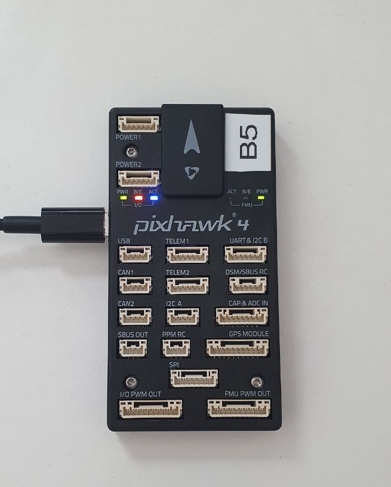
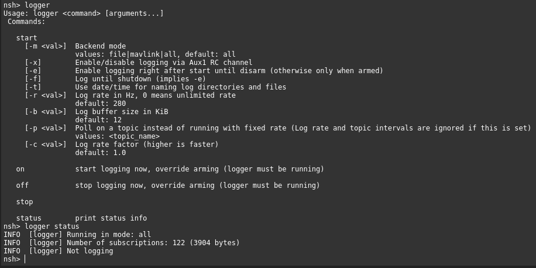

# PX4 development additional notes and guides

[toc]

# Introduction

PX4 firmware development is a pain for newcomers. I think the reason for that is due to PX4 documentation serving more as a *reference* rather than a *guide*. These notes are written down more as a *guide* to help understanding rather than  *reference* page.


This is not meant to replace the official [PX4 development docs](https://docs.px4.io/main/en/dev_setup/getting_started.html), **read this first as these notes are meant to supplement it**. We will be referencing the development docs throughout this guide. Basic C, C++ (templates and classes), and firmware development concepts are required to understand these notes.

Assumptions: 

- Using Ubuntu OS to pull, develop and build the PX4 firmware.
- `make px4_sitl jmavsim` in the PX4 root directory works.
- The build target in these notes will be Holybro Pixhawk4, there will be slight differences in the modules loaded and nsh output.
- Using QGroundControl.
- You have read through and did the getting started development section.

The notes were based on this [PX4-commit](https://github.com/PX4/PX4-Autopilot/tree/6ee2d796ead73ec074892e3f402032352f5d66dd).

More simplified example codes is given under examples directory.

# Core ideas

## NuttX RTOS & NSH

PX4 firmware runs on top of NuttX RTOS (real-time operating systems), a specialized OS that is usually deterministic (always take the same amount of time to execute a task/programs). It also comes with NuttX shell (nsh) a linux like command shell that you can use via QGC -> MavLinkTools -> MavLinkConsole. You can use nsh to access the file system, monitor CPU usage, start programs (tasks), etc.

## PX4 as a set of NuttX Applications

PX4 applications are categorized to their roles. Inside, `PX4-Autopilot/src` there are the following folders each containing code for the respective applications:


- Modules - Contains modules for the main logic of the Flight Controllers, from controllers to EKF estimation.
- Drivers - Contains modules for drivers for sensors, RC, etc.
- Systemscmds - Contains additional system commands (top, param, reboot, shutdown, etc.)

## uORB as an internal messaging system between apps

Internally, PX4 has a dataspace that any programs or apps can publish(write) or subscribe(listen) to. This is known as uORB (Micro Object Request Broker) and it is an internal publish/subscribe messaging system that the different PX4 applications use to communicate with each other. Usually, drivers publish sensor messages to the uORB dataspace which is then subscribed (listened to) by the controller or estimators modules. You can think of it like a radio station broadcasting different channels. Each channel  represents a specific message topic. Listeners can tune in to the  channels they like, and the radio station broadcasts messages relevant  to those channels. The radio station acts as the publisher, and the  listeners are the subscribers who receive messages based on their chosen channels.

In the image above, we have the accelerometer module (accel_driver) publishing accelerometer messages (accel_data) that is being subscribed by the estimators module. Dashed line indicates that the module publishes messages, while solid lines indicates that the module is subscribing to that message data. 

The exact module, message and graph is different in the actual PX4 firmware, the graph above just demonstrates the idea of a uORB dataspace that modules any modules can publish/subscribe to.   

## Parameters & Configuration

Parameters are an integral part of the PX4 flight system. They are used by PX4 applications and can be easily modified by QGC. They are stored inside EEPROM (internal microcontroller storage) itself.

# Getting familiar in a NuttX Shell

NuttX shell is a great place to build an intuition for PX4 development. This section explores the NuttX shell using QGC Mavlink shell connected by the Micro-USB port of the holybro pixhawk4. 

1. Open QGC -> Analyze Tools -> MAVLink Console to open a NuttX shell.
2. The command line follows the following format, 
3. `<command_or_module_name> <arguments_to_pass>`
4. In general, Unix-like commands such as `ls`, `cd`, `top`, and `dmesg` work.
5. There are also other commands PX4 provides you can explore such as `i2cdetect`.

## SystemConsole vs  Mavlink NuttX Shell

There is two ways to connect to the NuttX shell (nsh), either via QGC Mavlink (microUSB) or using a serial console like PuTTY and connecting it through the FMU/debug port with an FTDI cable. There isn't much difference in between them **but not all** console outputs will be displayed in QGC Mavlink shell compared to the serial console via FTDI cable. Both will still display the `nsh>` prompt.




## Listing out all modules

You can type in `help` and it will list all of the **modules** inside the firmware. Below is an output from an unmodified PX4 firmware with a generic x quad-copter airframe. As you can see there are alot of modules (sensor drivers, controllers, estimators, systemcheck, etc)! 


## Modules and Commands

Each of the Modules listed is also a **valid** command that you can type into the nsh. In general modules have 3 default commands on them, `start` , `stop` , `status`. Typing only the **module name ** as a command will usually give a brief instruction on how to use it. 

For example, we can type `logger`  and nsh will give more information about the `logger` module.

If we were to type `logger status`, it will print out the status of the logger module, the fact that it is running in the background and not yet logging any data (since the aircraft is not armed).



Lets log some data with `logger on` and then after a few seconds we can stop logging by giving the `logger off` command (these 2 commands does not print any output back to the nsh).

## ls and the file systems 

Similar to Unix, we can use the `ls` (list all contents) and `cd`  (change directory) commands to explore the NuttX file system. Typing ls will list out the current working directory and the subsequent folders and files. Below shows the directories inside the root folder. 


First let's go to the log directory of the SD card using `cd /fs/microsd/log`. Typing `ls` will list out all of the flight logs in the SD card. It should not be empty, if you have use the `logger` command previously to log some data. 


We can also do a simple file write into the microsd card by first going to that microsd directory `cd /fs/microsd` , then typing `echo "hello world" > helloworld.txt`  command. After that 'helloworld.txt" file would be created in that directory and you can verify this with the `ls` command. 


## Directories inside root /

There are 6 directories inside root their rough functionalities are described below:

- /bin - Contains module binaries
- /dev - A pseudo-file system to represent I/O (pwm, serial, etc) 
- /etc -  Files from the PX4-autopilot ROMFS directory (/PX4-Autopilot/ROMFS) will be copied here (autostart scripts, etc) 
- /fs - Filesystem that inclues the microsd 
- /obj - Contains all uORB msgs 
- /proc - A pseudo-file system to represent system and tasks information 

## ls /obj and listening to uORB topics and messages 

/obj is an important folder we want to take note of. Typing `ls /obj` will list out all of the messages that uORB is handling in this firmware. Multiple topic instances are indexed with (0,1,2,...). 


We can use the `listener` command to listen to the topic messages. For example, if we want to listen to the raw accelerometer data, we can type `listener sensor_accel`  and it will give out the following output:


Notice in Holybro Pixhawk 4 there is 2 sensor instances (0 and 1), presumable they are from ICM-20689 and BMI055 respectively. 

## The uORB graph and msgs 

To find out more about each msgs and their corresponding modules that are listening or subscribing to it you can head [here ](https://docs.px4.io/main/en/middleware/uorb_graph.html). 

- Pick your target preset (FMUv5 for Holybro pixhawk4) to only include the modules and topics in that particular target.
- Modules are shown in gray with rounded corners while topics are displayed as colored rectangular boxes. Below is an example of the *sensor_accel* topic and their corresponding modules.


Topics are coloured while modules are grey in colour. Modules that publishes the topic connected with dashed lines while modules that are listening are connected with solid lines. 

This is a powerful tool to paint a picture of how each module / uORB topics interact with each other. For example we can trace the **bmi055** sensor module publishes accelerometer data that is piped into the **ekf2** (extended kalman filter) module to produce the estimated *vehicle_attitude*. 
**bmi055**  --> *sensor_accel* &rarr; **sensors** --> *vehicle_imu* &rarr;**ekf2** --> *vehicle_attitude*

## Tasks and Work Queue Tasks.

PX4 modules are separated into  two types of tasks: 

**Normal tasks** and tasks in a group also known as **Work Queue Tasks**. 

- Normal tasks are modules that runs on its own stack and thread priority.

- Modules in a Work queue tasks are just tasks that have similar functionality and thus are grouped together sharing the same stack memory and thread priority. 
- Work Queue Tasks are unable poll (wait) for new messages which gives rise to a different control flow implementation compared to Normal tasks (will be covered more under applications development).

The main difference between them is that running programs in a work_queue task group is generally favorable as they require less RAM and task switches compared to tasks. However, Work queue tasks cannot sleep, poll for messages, or perform blocking I/O operations like reading from a file. For heavy computation or long-running tasks, it is recommended to run them in a separate task or work queue group. More information about them can be found [here](https://docs.px4.io/main/en/concept/architecture.html#runtime-environment).

## Using `top` to monitor programs and system resources

Typing `top` command will list all tasks that are currently working in the system and their corresponding statistics. In NuttX, a lower priority number would generally be considered a higher priority for a task and thus have more access to CPU time.  

- Task priority 255 has the lowest priority followed while 1 is considered the highest.


Notice that the `wq:` prefix in some of the tasks name which refer to the work queue tasks. To see what is running in each work_queue task group, type `work_queue status` and it will display all the work_queue tasks. 


From the output above

- The **bmi055** and **icm20689** IMU module driver are under wq:SPI1 work_queue task group each with ~670hz and 800hz respetively
-  The **ekf2** estimator module is under wq:INS0 and wq:INS1 work_queue task group with around ~200hz
- The **mc_rate_control** controller module is under wq:rate_ctrl work_queue task group with around ~666hz 

Notice how the majority of the PX4 modules are grouped into work_queues tasks group according to their categories  (SPI/InertialEstimators/RateControl/etc...). 

# Build systems

This section covers building the PX4 firmware, selecting which modules/programs to be included in the firmware (boardconfig)

Ensure you can run `make px4_sitl jmavsim` inside the PX4-autopilot root directory. If there are built errors, these notes ***do not\*** provide any clues on how to solve them. If `make px4_sitl jmavsim` works, then there should not be any issue in building the PX4 firmware for different types of target boards.

## Building for a target

The build command has the following pattern, 

1. `make <flight_controller_standard> <additional_commands>`
2. `<flight_controller_standard>` refers to the flight controller standard that board the board uses, for example, if you are flashing pix-hawk4 it uses the FMUv5 standard which is 
3. `make px4_fmu-v5_default`
4. After executing the command above, the firmware will be located inside `PX4-Autopilot/build/px4_fmu-v5_default/px4_fmu-v5_default.px4`

More information for different target boards can be found [here](https://docs.px4.io/main/en/dev_setup/building_px4.html#nuttx-pixhawk-based-boards).

## Selecting and deselecting modules using boardconfig and flashing


To select/deselect specific modules into the PX4 firmware, type 

1. `make px4_fmu-v5_default boardconfig`
2. This will bring up a kconfig menu screen that allows you to select and deselect applications/modules that you want to include in your firmware. 
3. Go to examples and select **hello** and **work_item** modules and deselect **fake_gps** and save them
4. Rebuilt the firmware again with `make px4_fmu-v5_default` 
5. Flash by using QGC -> Vehicle Setup -> Firmware -> PX4 pro -> AdvancedSettings -> Custom firmware file... -> Ok -> select `PX4-Autopilot/build/px4_fmu-v5_default/px4_fmu-v5_default.px4` 
   You can also use the command `make px4_fmu-v5_default upload` (replug micro-USB when prompted with waiting for bootloader)
6. Take note that each build target will have different boardconfigs!! ie, `make px4_fmu-v5_default boardconfig` will have a different configuration from `make px4_sitl boardconfig` 

Access the NuttX shell via QGC, type `help` and you will notice that **work_item_example** and **hello** are there while **fake_gps** is no longer there. 


You can start `work_item_example start` and monitor it under `work_queue status`  which will show under wq:test1 work_queue task group.


The `hello` module might be buggy(?) in which stopping, `hello stop`, does no effect on its status, `hello status`. 

# Module development


This section covers more in detail about the development patterns of the PX4 firmware. Mainly, project structure, tasks and work_queues, msgs and topics, and parameters. Once again, read through the [first application tutorial](https://docs.px4.io/main/en/modules/hello_sky.html) and the subsequent [Application/Module Template](https://docs.px4.io/main/en/modules/module_template.html). These notes are supplementary and extends the concepts covered there. 

## Another hello sky and Project Structure 

Let's get a clearer view of PX4 project structure by making another module named **example_hellosky**. We are going to put our source files under `PX4-Autopilot/src/examples`.  Create a new folder called **example_hellosky** and their corresponding files (you can leave the files empty). So our project structure will look something like below.

```markdown
├── src
│   ├── ....
│   ├── examples
│   │   ├── ....
│   │   ├── example_hellosky
│   │   │	├── CMakeLists.txt
│   │   │	├── example_hellosky.c
│   │   │	├── Kconfig
│   │   ├── ....
│   ├── ....
├── ....
```

Inside our C file copy the following code into it:

```C++
#include <px4_platform_common/log.h>

__EXPORT int example_hellosky_main(int argc, char *argv[]);

int example_hellosky_main(int argc, char *argv[])
{
	PX4_INFO("Hello Sky!");

	for (int i = 0 ; i < 100; i++){
		PX4_INFO("Inside loop at %i", i);
		px4_usleep(1000000);
	}
	PX4_INFO("exiting");
	
	return 0;
}
```

This is a simple app that will loop every second 100 times while printing the index of the loop.

The first noticeable thing is the `__EXPORT` keyword in `__EXPORT int example_hellosky_main(int argc, char *argv[]);` function prototype statement. The details about the `__EXPORT` keyword are a bit foggy, [explains slightly more](https://discuss.px4.io/t/export-keyword/4510), basically it makes the function available for external use or linking. Think of it as a special keyword for the PX4 build process. `example_hellosky_main` is also an important symbol, with `example_hellosky` being the module name itself.

Inside Kconfig copy the following code into it:

```
menuconfig EXAMPLES_EXAMPLE_HELLOSKY
	bool "example_hellosky"
	default n
	---help---
		Enable support for example_hellosky
```

Kconfig exposes the module as an option to build in `boardconfig`  and tells the build process the folder location of the module. By default the path location is specified in upper letter case so,  `EXAMPLES_EXAMPLE_HELLOSKY` is  `examples/example_hellosky`, even though using small letters also work, the standard seems to use upper letter case.  The rest of the keywords are pretty self-explanatory, `bool "example_hellosky"` just means it is a tickbox and `--help--` just gives hints in the `boardconfig` menu. Be careful of the spelling mistakes!

Inside CMakeLists.txt copy the following code into it:

```
px4_add_module(
	MODULE examples__example_hellosky
	MAIN example_hellosky
	SRCS
		example_hellosky.c
	DEPENDS
	)
```

This is our CMakelists.txt file which consists of a single `px4_add_module`  statement. 

- The `MODULE examples__example_hellosky`  keyword refers to the module path, take note of the double underscores `__`  after the folder filename. 
- The `MAIN` keyword will generate the executable/module that will appear as a command, therefore, `MAIN example_hellosky` will generate the `example_hellosky` module. 
- The module name and the entrypoint in the .c file must be similar. ie, `MODULE examples__example_hellosky` with  `__EXPORT int example_hellosky_main(int argc, char *argv[]);`. Otherwise, you will encounter linker build errors such as `undefined reference <name>` 
- All source file is defined under `SRCS`.

Below is a graph that shows how the module name symbols are related to the build files and source files.


Now its time to enable and build the module

- Enable the module in boardconfig with `make px4_fmu-v5_default boardconfig` , under examples enable ``example_hellosky``.
- Now build with the new config `make px4_fmu-v5_default`.

## Auto-starting Modules

PX4 modules that are automatically started are defined under the  `PX4-Autopilot/ROMFS/px4fmu_common/init.d/rcS` file. The startup script has a similar syntax to the bash script and is well commented out. It is worthwhile to go through the comments.

To start our **example_hellosky** module to start on system boot, we add the line `start example_hellosky`  near the bottom of the script. 

```
...
#
# End of autostart.
#
example_hellosky start
fi
...
```

Now we can test out our module. 

1) Re-build the project again using `make px4_fmu-v5_default` after including the new line in the start-up script
2) Flash the firmware using QGC or `make px4_fmu-v5_default upload`
3) Open the QGC mavlink NuttX shell and type `top` you should see that our application is already running (if ~100s has not passed since boot).


4. To kill it we use the `kill -9 <PID_NUMBER>` command in this case its `kill -9 1370`

Notes:

- There is no `PX4_INFO` printout to the nsh when you are using the QGC Mavlink Shell! You can use `dmesg` to check it though (as it will be printed alongside system information). 
- You can run it from the nsh by just typing `example_hellosky &` (we *did not program* the start, stop and status command args), the `&` command will cause it to be a background application so you can close it using the `kill` command. If you don't, Ctrl+c doesn't work so your nsh shell will be stuck there until the loop finishes unless you make it into a background application with `&` command.
- You can see the output of the tasks if you are accessing nsh from the FTDI debug cable. 

For Linux/macOS, the startup script is at `PX4-Autopilot/ROMFS/px4fmu_common/init.d-posix`, you can read more about startup scripts [here](https://docs.px4.io/main/en/concept/system_startup.html).

## C or C++ ?

In the official documentation, there is a sudden shift in the programming language used from C in the [first application tutorial](https://docs.px4.io/main/en/modules/hello_sky.html) and subsequently C++ in [Application/Module Template](https://docs.px4.io/main/en/modules/module_templat e.html) in which a sample work_queue tasks is shown. There is also a **difference** in how publisher and subscriber functions are called. Since a majority of PX4 applications and libraries are written in C++ and the work_queue library seems to be only available in C++,

`#include <px4_platform_common/px4_work_queue/ScheduledWorkItem.hpp>`. 

We will continue with C++ to leverage as many benefits as possible.

## Understanding work_item example (Work Queue Task)

The `WorkItemExample` is a class that inherits from three base classes: `ModuleBase<WorkItemExample>`, `ModuleParams`, and `px4::ScheduledWorkItem`.

- The `ModuleBase<WorkItemExample>` implements common functionality for modules, such as 'start', 'stop', and 'status' commands.
- The `ModuleParams` is a base class for modules or classes that use configuration parameters.
- The `px4::ScheduledWorkItem` is a base class for modules or classes that are scheduled to execute at a desired rate.

When developing a module, there are two main aspects to focus on: the system part (init, commands, task_spawn) and the work part (subscribers, publishers, and run). Typically, the system part of the code should not be modified extensively, except for setting the task rate to a specific interval or setting it to be executed on new subscriber message. The main work or algorithm is implemented in the `run()` function, where subscribers and publishers are programmed.

Below is the sample code given for a *module that runs as a work queue tasks* with additional comments for improved clarity.

WorkItemExample.hpp

```C++

#pragma once

#include <px4_platform_common/defines.h>
#include <px4_platform_common/module.h>
#include <px4_platform_common/module_params.h>
#include <px4_platform_common/posix.h>
#include <px4_platform_common/px4_work_queue/ScheduledWorkItem.hpp>
#include <drivers/drv_hrt.h>
#include <lib/perf/perf_counter.h>
#include <uORB/Publication.hpp>
#include <uORB/Subscription.hpp>
#include <uORB/SubscriptionCallback.hpp>
#include <uORB/topics/orb_test.h>
#include <uORB/topics/parameter_update.h>
#include <uORB/topics/sensor_accel.h>
#include <uORB/topics/vehicle_status.h>

using namespace time_literals;

// Inherits 3 different classes 
class WorkItemExample : public ModuleBase<WorkItemExample>, public ModuleParams, public px4::ScheduledWorkItem
{
public:
	WorkItemExample();
	~WorkItemExample() override;
	
    // System functions
	/** @see ModuleBase */
	static int task_spawn(int argc, char *argv[]);

	/** @see ModuleBase */
	static int custom_command(int argc, char *argv[]);

	/** @see ModuleBase */
	static int print_usage(const char *reason = nullptr);
	
    // function that is executed on init
	bool init();
	
    // default prints perf, performance counters, to the nsh shell
	int print_status() override;

private:
    
    // A function that runs every scheduled interval
	void Run() override;

	// Publications
	uORB::Publication<orb_test_s> _orb_test_pub{ORB_ID(orb_test)};

	// Subscriptions
	uORB::SubscriptionCallbackWorkItem _sensor_accel_sub{this, ORB_ID(sensor_accel)};        // subscription that schedules WorkItemExample when updated
	uORB::SubscriptionInterval         _parameter_update_sub{ORB_ID(parameter_update), 1_s}; // subscription limited to 1 Hz updates
	uORB::Subscription                 _vehicle_status_sub{ORB_ID(vehicle_status)};          // regular subscription for additional data

	// Performance (perf) counters that are printed on "status" command
	perf_counter_t	_loop_perf{perf_alloc(PC_ELAPSED, MODULE_NAME": cycle")};
	perf_counter_t	_loop_interval_perf{perf_alloc(PC_INTERVAL, MODULE_NAME": interval")};

	// Using Parameters Macro 
	DEFINE_PARAMETERS(
		(ParamInt<px4::params::SYS_AUTOSTART>) _param_sys_autostart,   /**< example parameter */
		(ParamInt<px4::params::SYS_AUTOCONFIG>) _param_sys_autoconfig  /**< another parameter */
	)


	bool _armed{false};
};
```

Notice there are 3 different types of subscribers used:

- `uORB::SubscriptionCallbackWorkItem _sensor_accel_sub`  - Using this Subscriber, WorkItemExample `run()` can be configured to run on every new accelerometer message (`init()` function of the .cpp have comments on how to use it below).
- `uORB::SubscriptionInterval _parameter_update_sub` - Subscriber that will only be updated on specified interval.
- `uORB::Subscription _vehicle_status_sub ` - Standard Subscriber that is updated on every new vehicle messages.

There is only a single publisher, `uORB::Publication<orb_test_s> _orb_test_pub{ORB_ID(orb_test)};`. 

WorkItemExample.cpp

```C++
#include "WorkItemExample.hpp"

WorkItemExample::WorkItemExample() :
	ModuleParams(nullptr),
	ScheduledWorkItem(MODULE_NAME, px4::wq_configurations::test1) // test1 work queue configuration
{
}

WorkItemExample::~WorkItemExample()
{
	perf_free(_loop_perf);
	perf_free(_loop_interval_perf);
}

// System function runs on task spawn
bool WorkItemExample::init()
{	
    // There are 2 ways to schedule this work tasks, 
    // either 
	// execute Run() on every sensor_accel publication
	if (!_sensor_accel_sub.registerCallback()) {
		PX4_ERR("callback registration failed");
		return false;
	}
	// alternatively, Run on fixed interval
	// ScheduleOnInterval(5000_us); // 2000 us interval, 200 Hz rate

	return true;
}

// Main work/algorithm is implemented here
void WorkItemExample::Run()
{
	if (should_exit()) {
		ScheduleClear();
		exit_and_cleanup();
		return;
	}
	
	// Start perf counters that are used by the 'status' command
	perf_begin(_loop_perf);
	perf_count(_loop_interval_perf);

	// Check if parameters have changed
	if (_parameter_update_sub.updated()) {
		// clear update
		parameter_update_s param_update; // tmp message to hold subscriber data
		_parameter_update_sub.copy(&param_update); // copy subscriber data to tmp msg
        // DO WORK
		updateParams(); // update module parameters (in DEFINE_PARAMETERS)
	}

	// Example
	//  update vehicle_status to check arming state
	if (_vehicle_status_sub.updated()) {
		vehicle_status_s vehicle_status; // tmp message to hold subscriber data
		if (_vehicle_status_sub.copy(&vehicle_status)) { // copy subscriber data to tmp msg
        	// DO WORK
			const bool armed = (vehicle_status.arming_state == vehicle_status_s::ARMING_STATE_ARMED);

			if (armed && !_armed) {
				PX4_WARN("vehicle armed due to %d", vehicle_status.latest_arming_reason);

			} else if (!armed && _armed) {
				PX4_INFO("vehicle disarmed due to %d", vehicle_status.latest_disarming_reason);
			}

			_armed = armed;
		}
	}

	// Example
	//  grab latest accelerometer data
	if (_sensor_accel_sub.updated()) {
		sensor_accel_s accel; // tmp message to hold subscriber data

		if (_sensor_accel_sub.copy(&accel)) { // copy subscriber data to tmp msg
			// DO WORK

			// access parameter value (SYS_AUTOSTART)
			if (_param_sys_autostart.get() == 1234) {
				// do something if SYS_AUTOSTART is 1234
			}
		}
	}

	// Example
	//  publish some dummy data to 
	orb_test_s data{};
	data.val = 314159;
	data.timestamp = hrt_absolute_time();
	_orb_test_pub.publish(data);
	
    // function call to update performance counters 
	perf_end(_loop_perf);
}

// System function that handles task spawning, usually not touched at all.
int WorkItemExample::task_spawn(int argc, char *argv[])
{
	WorkItemExample *instance = new WorkItemExample();

	if (instance) {
		_object.store(instance);
		_task_id = task_id_is_work_queue;

		if (instance->init()) {
			return PX4_OK;
		}

	} else {
		PX4_ERR("alloc failed");
	}

	delete instance;
	_object.store(nullptr);
	_task_id = -1;

	return PX4_ERROR;
}

// System function to print out performance status
int WorkItemExample::print_status()
{
	perf_print_counter(_loop_perf);
	perf_print_counter(_loop_interval_perf);
	return 0;
}

// System function to implement custom commands
int WorkItemExample::custom_command(int argc, char *argv[])
{
	return print_usage("unknown command");
}

// System function to print out module description
int WorkItemExample::print_usage(const char *reason)
{
	if (reason) {
		PX4_WARN("%s\n", reason);
	}

	PRINT_MODULE_DESCRIPTION(
		R"DESCR_STR(
### Description
Example of a simple module running out of a work queue.

)DESCR_STR");

	PRINT_MODULE_USAGE_NAME("work_item_example", "template");
	PRINT_MODULE_USAGE_COMMAND("start");
	PRINT_MODULE_USAGE_DEFAULT_COMMANDS();

	return 0;
}

// Entry point of the code! 
extern "C" __EXPORT int work_item_example_main(int argc, char *argv[])
{
    // Calls the WorkItemExample main function (inherited from ModuleBase class).
	return WorkItemExample::main(argc, argv);
}
```

### Custom work_queue configurations 

Notice in the class constructor below, the `ScheduledWorkItem` class has the `px4::wq_configurations::test1` parameter.

```C++
WorkItemExample::WorkItemExample() :
	ModuleParams(nullptr),
	ScheduledWorkItem(MODULE_NAME, px4::wq_configurations::test1) // test1 work queue configuration
{
}
```

PX4 has defined a number of work_queue configurations which can be found [here]((https://github.com/PX4/PX4-Autopilot/blob/main/platforms/common/include/px4_platform_common/px4_work_queue/WorkQueueManager.hpp#LL49C8-L49C8)) in the source code. If we want to our own work_queue group with configs, we can use the `wq_config_t` struct that is defined under `px4` namespace in the source code. The struct source code snippet is shown below.

```C++
namespace px4{
    ...
struct wq_config_t {
	const char *name;
	uint16_t stacksize;
	int8_t relative_priority; // relative to max (255), 0 means priority 255 (lowest priority), -1 means 254, ...
};
    ...
}
```

Therefore to create our own custom work_queue task group we can just create the following variable outside the class definition,

```C++
// 2400 stack size and priority number 254 
static constexpr px4::wq_config_t auxillary_work_queue{"wq:auxillary_work_queue", 2400, -1};
```

And pass it to the class constructor.

```C++
WorkItemExample::WorkItemExample() :
	ModuleParams(nullptr),
	ScheduledWorkItem(MODULE_NAME, auxillary_work_queue)
{
}
```

## Understanding Tasks

Now we will take a look at Tasks and the corresponding task template base code. 

Below is the sample code for a *module that runs as tasks* with additional comments for improved clarity. This module is also much simplified as it only has two subscribers one that listens to parameter updates and a *temporary* subscriber that listens to *sensor_combined* topic. The rate of this task is coupled to the rate of which the *sensor_combined* topic is published by *waiting* for it (only viable for modules configured as Tasks).

*template_module.h* 

```C++
#pragma once

#include <px4_platform_common/module.h>
#include <px4_platform_common/module_params.h>
#include <uORB/SubscriptionInterval.hpp>
#include <uORB/topics/parameter_update.h>

using namespace time_literals;

extern "C" __EXPORT int template_module_main(int argc, char *argv[]);

// Only inherits ModuleBase and ModuleParams class, there is no px4::ScheduledWorkItem class
class TemplateModule : public ModuleBase<TemplateModule>, public ModuleParams
{
public:
	TemplateModule(int example_param, bool example_flag);

	virtual ~TemplateModule() = default;

	/** @see ModuleBase */
	static int task_spawn(int argc, char *argv[]);

	/** @see ModuleBase */
	static TemplateModule *instantiate(int argc, char *argv[]);

	/** @see ModuleBase */
	static int custom_command(int argc, char *argv[]);

	/** @see ModuleBase */
	static int print_usage(const char *reason = nullptr);

	/** @see ModuleBase::run() */
	void run() override;

	/** @see ModuleBase::print_status() */
	int print_status() override;

private:

	/**
	 * Check for parameter changes and update them if needed.
	 * @param parameter_update_sub uorb subscription to parameter_update
	 * @param force for a parameter update
	 */
	void parameters_update(bool force = false);


	DEFINE_PARAMETERS(
		(ParamInt<px4::params::SYS_AUTOSTART>) _param_sys_autostart,   /**< example parameter */
		(ParamInt<px4::params::SYS_AUTOCONFIG>) _param_sys_autoconfig  /**< another parameter */
	)

	// Subscriptions
	uORB::SubscriptionInterval _parameter_update_sub{ORB_ID(parameter_update), 1_s};

};
```

As we can see,  it is relatively similar to the work_queue tasks template header file except that the class *does not inherit* the `px4::ScheduledWorkItem` class. 

*template_module.cpp*

```C++
#include "template_module.h"

#include <px4_platform_common/getopt.h>
#include <px4_platform_common/log.h>
#include <px4_platform_common/posix.h>

#include <uORB/topics/parameter_update.h>
#include <uORB/topics/sensor_combined.h>

// Code that is executed when "status" arg is used in the command line 
int TemplateModule::print_status()
{
	PX4_INFO("Running");
	// TODO: print additional runtime information about the state of the module

	return 0;
}

// To handle custom commands
int TemplateModule::custom_command(int argc, char *argv[])
{
	/*
	if (!is_running()) {
		print_usage("not running");
		return 1;
	}

	// additional custom commands can be handled like this:
	if (!strcmp(argv[0], "do-something")) {
		get_instance()->do_something();
		return 0;
	}
	 */

	return print_usage("unknown command");
}

int TemplateModule::task_spawn(int argc, char *argv[])
{
    // Task configurations
	_task_id = px4_task_spawn_cmd("module", // Process name
				      SCHED_DEFAULT, // Scheduling type (RR or FIFO)
				      SCHED_PRIORITY_DEFAULT, // Scheduling priority
				      1024, // Stack size of the new task or thread
				      (px4_main_t)&run_trampoline, // Task (or thread) main function
				      (char *const *)argv); // Void pointer to pass to the new task (for command line arguments)

	if (_task_id < 0) {
		_task_id = -1;
		return -errno;
	}

	return 0;
}

TemplateModule *TemplateModule::instantiate(int argc, char *argv[])
{
	int example_param = 0;
	bool example_flag = false;
	bool error_flag = false;

	int myoptind = 1;
	int ch;
	const char *myoptarg = nullptr;

	// parse CLI arguments
	while ((ch = px4_getopt(argc, argv, "p:f", &myoptind, &myoptarg)) != EOF) {
		switch (ch) {
		case 'p':
			example_param = (int)strtol(myoptarg, nullptr, 10);
			break;

		case 'f':
			example_flag = true;
			break;

		case '?':
			error_flag = true;
			break;

		default:
			PX4_WARN("unrecognized flag");
			error_flag = true;
			break;
		}
	}

	if (error_flag) {
		return nullptr;
	}

	TemplateModule *instance = new TemplateModule(example_param, example_flag);

	if (instance == nullptr) {
		PX4_ERR("alloc failed");
	}

	return instance;
}

TemplateModule::TemplateModule(int example_param, bool example_flag)
	: ModuleParams(nullptr)
{
}

// Main work is done here
// The loop is synchronized to the sensor_combined topic subscribtion
void TemplateModule::run()
{
	// Temporary subscriber
	int sensor_combined_sub = orb_subscribe(ORB_ID(sensor_combined));
	
    // specialized struct to handle poll events
	px4_pollfd_struct_t fds[1];
	fds[0].fd = sensor_combined_sub;
	fds[0].events = POLLIN;

	// initialize parameters
	parameters_update(true);
	
    // Main loop
	while (!should_exit()) {

		// wait for up to 1000ms for data from sensor_combined
		int pret = px4_poll(fds, (sizeof(fds) / sizeof(fds[0])), 1000);

		if (pret == 0) {
			// Timeout: let the loop run anyway, don't do `continue` here

		} else if (pret < 0) {
			// this is undesirable but not much we can do
			PX4_ERR("poll error %d, %d", pret, errno);
			px4_usleep(50000);
			continue;

		} else if (fds[0].revents & POLLIN) {
			// New data detected 
			struct sensor_combined_s sensor_combined;
			orb_copy(ORB_ID(sensor_combined), sensor_combined_sub, &sensor_combined);
			// TODO: do something with the data...

		}
		// Check for parameter updates
		parameters_update();
	}
    
	// Unsubscribe at the end
	orb_unsubscribe(sensor_combined_sub);
}

void TemplateModule::parameters_update(bool force)
{
	// check for parameter updates
	if (_parameter_update_sub.updated() || force) {
		// clear update
		parameter_update_s update;
		_parameter_update_sub.copy(&update);

		// update parameters from storage
		updateParams();
	}
}

int TemplateModule::print_usage(const char *reason)
{
	if (reason) {
		PX4_WARN("%s\n", reason);
	}

	PRINT_MODULE_DESCRIPTION(
		R"DESCR_STR(
### Description
Section that describes the provided module functionality.

This is a template for a module running as a task in the background with start/stop/status functionality.

### Implementation
Section describing the high-level implementation of this module.

### Examples
CLI usage example:
$ module start -f -p 42

)DESCR_STR");

	PRINT_MODULE_USAGE_NAME("module", "template");
	PRINT_MODULE_USAGE_COMMAND("start");
	PRINT_MODULE_USAGE_PARAM_FLAG('f', "Optional example flag", true);
	PRINT_MODULE_USAGE_PARAM_INT('p', 0, 0, 1000, "Optional example parameter", true);
	PRINT_MODULE_USAGE_DEFAULT_COMMANDS();

	return 0;
}

// Entry point of the code! 
int template_module_main(int argc, char *argv[])
{
    // Calls the TemplateModule main function (inherited from ModuleBase class).
	return TemplateModule::main(argc, argv);
}
```

The first thing to notice under task spawn function, `int TemplateModule::task_spawn(int argc, char *argv[])` there are task decelerations configurations defined.

```C++
    // Task configurations
	_task_id = px4_task_spawn_cmd("module", // Process name
				      SCHED_DEFAULT, // Scheduling type (RR or FIFO)
				      SCHED_PRIORITY_DEFAULT, // Scheduling priority
				      1024, // Stack size of the new task or thread
				      (px4_main_t)&run_trampoline, // Task (or thread) main function
				      (char *const *)argv); // Void pointer to pass to the new task (for command line arguments)
```

Another important aspect to highlight is the close relationship between the program's flow logic and a temporary subscriber named `sensor_combined_sub`. This subscriber is passed as a parameter to the `px4_pollfd_struct_t fds[1];` struct array. Subsequently, the program enters a waiting state by utilizing the `px4_poll` function, which takes the `fds` struct as an argument. This mechanism enables the module to *wait* for a new message to arrive.

```C++
...
int sensor_combined_sub = orb_subscribe(ORB_ID(sensor_combined));
px4_pollfd_struct_t fds[1]; // struct to handle subscribers that is being polled
fds[0].fd = sensor_combined_sub; // subsriber
fds[0].events = POLLIN; // on new message

// Main loop
while (!should_exit()) {

	// wait for up to 1000ms for data from sensor_combined
	int pret = px4_poll(fds, (sizeof(fds) / sizeof(fds[0])), 1000);
    ...
}
```

## Function calls to publish and subscribe

By now, you should notice a difference in the functions used to publish and subscribe. Below is a quick summary and notes with regards to them.

### Publishing

- Using `orb_advertise` function return type

  ```C++
  #include <uORB/uORB.h> // include the publisher funcs
  #include <uORB/topics/sensor_accel.h> // include sensor msgs
  
  // Prepare the message and initialize it to 0
  sensor_accel_s accel_msg;
  memset(&accel_msg, 0, sizeof(accel_msg));
  
  // Create publisher handler
  orb_advert_t sensor_pub = orb_advertise(ORB_ID(sensor_accel), &accel_msg);
  
  // Do some work...
  accel_msg.x = 0;
  accel_msg.y = 0;
  accel_msg.z = 9.81;
  
  // Publish the message 
  orb_publish(ORB_ID(sensor_accel), sensor_pub, &accel_msg);
  ```

- Using `uORB::Publication<message_type>`  type

  ```C++
  #include <uORB/Publication.hpp> // notice its a .hpp file (only C++)
  #include <uORB/topics/sensor_accel.h> // include sensor msgs
  
  // Create the publisher handler 
  uORB::Publication<sensor_accel> _orb_test_pub{ORB_ID(sensor_accel)};
  
  // Prepare the message and initialize it to 0
  sensor_accel_s accel_msg;
  memset(&accel_msg, 0, sizeof(accel_msg));
  
  // Publish the message
  _orb_test_pub.publish(accel_msg);
  
  ```

### Subscribing

- Using `orb_subscribe` function return type and `px4_pollfd_struct_t`

  ```C++
  #include <uORB/uORB.h>
  #include <uORB/topics/vehicle_acceleration.h>
  
  /* subscribe to vehicle_acceleration topic */
  int sensor_sub_fd = orb_subscribe(ORB_ID(vehicle_acceleration));
  /* limit the update rate to 5 Hz */
  orb_set_interval(sensor_sub_fd, 200);
  
  // Use a px4_pollfd_struct_t struct to keep track of subscribers
  /* one could wait for multiple topics with this technique, just using one here */
  px4_pollfd_struct_t fds[] = {
      { .fd = sensor_sub_fd,   .events = POLLIN },
      /* there could be more file descriptors here, in the form like:
  		 * { .fd = other_sub_fd,   .events = POLLIN },
  		 */
  };
  
  ...
  // Wait for new data
  ...
      
  // If new data 
  if (fds[0].revents & POLLIN) {
      /* obtained data for the first file descriptor */
      struct vehicle_acceleration_s accel;
      /* copy sensors raw data into local buffer */
      orb_copy(ORB_ID(vehicle_acceleration), sensor_sub_fd, &accel);
      PX4_INFO("Accelerometer:\t%8.4f\t%8.4f\t%8.4f",
               (double)accel.xyz[0],
               (double)accel.xyz[1],
               (double)accel.xyz[2]);
  }
  
  ```

- Using `uORB::Subscription` 

  ```C++
  #include <uORB/Subscription.hpp> // .hpp only C++
  #include <uORB/topics/vehicle_acceleration.h>
  
  // Create handler
  uORB::Subscription _sensor_accel_sub{ORB_ID(sensor_accel)};
  
  // grab latest accelerometer data if available
  if (_sensor_accel_sub.updated()) {
      sensor_accel_s accel; // sensor accel msg
  	
      // Copy latest data into the sensor accel msg
      if (_sensor_accel_sub.copy(&accel)) {
          // DO WORK
      }
  }
  ```

  There two other subscriber types,  `SubscriptionCallbackWorkItem`,  `SubscriptionInterval` types but it should have similar usage other than different ways of declaring it.

 ## Topics and Messages 

A complete list of message topics and their corresponding message headers can be find here in their [git-hub page](https://github.com/PX4/PX4-Autopilot/tree/main/msg).  They have the following format. In general, the code needed for [TopicName].msg is :

```C++
#include <uORB/topics/[topic_name].h>

// ORB_ID is a special macro defined in PX4
uORB::Subscription subscriber{ORB_ID([topic_name])};

[topic_name]_s msg;   
```

## Custom uORB messages 

Lets create a new custom uORB message called `RandomNumbers.msg` that has two fields, a `timestamp` (uint64) and a `random_int` (uint8). Basically, this is a topic that contains an 8bit unsigned integer (0-255). The timestamp field is mandatory for all messages (tells when the message was published). We place the `RandomNumbers.msg` file under `/PX4-Autopilot/msg`. 

```
# They have the following syntax
# primitive_data_type name

uint64 timestamp	# time since system start (microseconds)

uint8 random_int 

```

Modify the `set` keyword in `CMakeLists.txt`, under `/PX4-Autopilot/msg/CMakeLists.txt`, to include the `RandomNumbers.msg`. It should be at the top of the file.

```
set(msg_files
	ActionRequest.msg
	ActuatorArmed.msg
	...
	RandomNumbers.msg
)
```

The `RandomNumbers.msg` is analyzed and generated into a C/C++ struct during build time, so rebuild the PX4 package `make px4_fmu-v5_default `. You should see a header file generated under `PX4-Autopilot/build/px4_fmu-v5_default/uORB/topics/random_numbers.h`.  Which contains the following code

```C++
#pragma once


#include <uORB/uORB.h>


#ifndef __cplusplus

#endif


#ifdef __cplusplus
struct __EXPORT random_numbers_s {
#else
struct random_numbers_s {
#endif
	uint64_t timestamp;
	uint8_t random_int;
	uint8_t _padding0[7]; // required for logger


#ifdef __cplusplus

#endif
};

#ifdef __cplusplus
namespace px4 {
	namespace msg {
		using RandomNumbers = random_numbers_s;
	} // namespace msg
} // namespace px4
#endif

/* register this as object request broker structure */
ORB_DECLARE(random_numbers);


#ifdef __cplusplus
void print_message(const orb_metadata *meta, const random_numbers_s& message);
#endif
```

Now you can include these header files inside your code. 

```C++
#include <uORB/topics/random_numbers.h>
```

## PX4 Design Patterns 

From the purpose of the module consider the following:

- Task or Work Queue task group (navigation, controller, auxiliary outputs, etc).
- Execution rate of the module.
- Number of Publishers and Subscribers.
- Parameters used.
- Flight modes and transmitter input (if any).

Once we have established the rough purpose and considerations of the module we can move on to fully implementing them in PX4. 

# Conclusion 

Hopefully, this comprehensive guide has provided valuable insights and practical information on the basics of PX4 development. Of course there is more topics to cover (I/O, sensor drivers, Airframes, Parameters) but hopefully these notes can serve as a foundation to understand the official PX4-guide better. 

## Additional references and helpful links 

- Official PX4-guide - https://docs.px4.io/main/en/development/development.html

- uORB graph - https://docs.px4.io/main/en/middleware/uorb_graph.html

- uORB msgs - https://github.com/PX4/px4_msgs/tree/main/msg

- uORB msging in depth mechanics - https://px4.io/px4-uorb-explained-part-1/

- Parameters in depth mechanics - https://px4.io/px4-parameters-part-1-overview/

- Basic development Workshop - https://www.youtube.com/watch?v=-1MASuJDGn4

  

